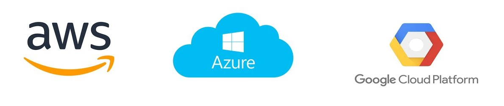

# Objetivo

Utilizar o cloud9 para explorar conceitos basicos sobre cloud com base no cliente de linha de comando da AWS


# Caracteriísticas:

Neste laboratório o terraform fica responsável por gerenciar os seguintes itens:

- Primeiros passos explorando o uso de um cliente para manipulação do Cloud Provider;

# Item 1: Introdução e testes com a api:

1.1. Iniciar o ambiente de Desenvolvimento Remoto:

Aceese a console AWS e em seguida selecione o serviço Cloud9, no ambiente **SEGLAB** clique em **OPEN IDE**:


1.2. Utilizando a ferramenta AWS CLI verifique a configuração de rede, subnet e security groups atuais:

```sh
aws ec2 describe-vpcs --query  'Vpcs[].[VpcId, CidrBlock]' --output table
aws ec2 describe-subnets --query  'Subnets[].[VpcId, AvailabilityZone, CidrBlock]' --output table
```

> É possível criar recursos dinamicamente utilizando apenas chamadas na api do Cloud Provider, utilizaremos este método para apresentar algumas características da manipulação de Cloud Computing;

# Item 2: Interagindo com a API

O objetivo por trás do uso de Cloud Computing é usufluir da agilidade em processos de criação e manutenção de infra-estrutura, o que é possível entre outros motivos devido as APIs que permitem uma mnipulação dinâmica de recursos virtuais;

Neste exemplo levantaremos três informações pra disparar a criação de uma instância:

2.1. Primeiro identifique o id da subnet onde a instância será criada:

```sh
aws ec2 describe-subnets --query  'Subnets[].[SubnetId]' --filters Name='availability-zone',Values='us-east-1a'
```

2.2. Depois o grupo de segurança, neste caso utilizaremos o grupo default entregue pelo cloud provider:

```sh
aws ec2 describe-security-groups --filters Name=group-name,Values=default --query "SecurityGroups[*].[GroupId]"
```

2.3. E por último a AMI, ou seja qual a imagem que será utilizada ao lançar a instância:

```sh
aws ec2 describe-images \
    --owners amazon \
    --filters "Name=name,Values=amzn2-ami-hvm-2.0.????????.?-x86_64-gp2" "Name=state,Values=available" \
    --query "reverse(sort_by(Images, &Name))[:1].ImageId"
```

2.4. Para facilitar a chamada de criação da instância grave as informações que obtemos a pouco em variaveis:

```sh
AWS_SUBNET_ID=$(aws ec2 describe-subnets \
    --filters Name='availability-zone',Values='us-east-1a' \
    --query  'Subnets[].[SubnetId]'  --output text)

AWS_SECGRP_ID=$(aws ec2 describe-security-groups \
    --filters Name=group-name,Values=default \
    --query "SecurityGroups[*].[GroupId]" --output text)

AWS_IMAGE_ID=$(aws ec2 describe-images \
    --owners amazon \
    --filters "Name=name,Values=amzn2-ami-hvm-2.0.????????.?-x86_64-gp2" "Name=state,Values=available" \
    --query "reverse(sort_by(Images, &Name))[:1].ImageId" --output text)
    

```

2.5. Com esses dados crie uma instância usando uma chamada na API:

```sh
aws ec2 run-instances \
    --count 1 --instance-type t2.micro \
    --image-id $AWS_IMAGE_ID \
    --security-group-ids $AWS_SECGRP_ID \
    --subnet-id $AWS_SUBNET_ID \
    --tag-specifications 'ResourceType=instance,Tags=[{Key=Name,Value=Test}]'
```

2.6. É possível autorizar o acesso na instância ou protocolos específicos usando a API de grupos de segurança:

```sh
aws ec2 authorize-security-group-ingress --group-id $AWS_SECGRP_ID \
     --ip-permissions IpProtocol=icmp,FromPort=-1,ToPort=-1,IpRanges='[{CidrIp=0.0.0.0/0}]'
```

Outros perfis de regras podem ser criados dinâmicamente, neste ponto vale uma olhada na [documentação do projeto](https://docs.aws.amazon.com/cli/latest/reference/ec2/authorize-security-group-ingress.html) ou em alternativas como o uso dos templates de automação para [ansible](https://docs.ansible.com/ansible/latest/collections/amazon/aws/ec2_group_module.html), [terraform](https://registry.terraform.io/modules/terraform-aws-modules/security-group/aws/1.0.0) e [cloud formation](https://docs.aws.amazon.com/AWSCloudFormation/latest/UserGuide/aws-properties-ec2-security-group.html);

2.7. Finalize o teste anterior aferindo se a instância está disponível:

```sh
aws ec2 describe-instances \
  --filters "Name=tag:Name,Values=Test"
```

2.8. É possível filtrar dados especificos como o IP da instância que deverá ser acessível via icmp devido a regra anterior;
```sh
aws ec2 describe-instances \
  --filters "Name=tag:Name,Values=Test" \
  --query "Reservations[*].Instances[*].PublicIpAddress" \
  --output=text
```

2.9. Destrua a instância criada para este exemplo:

```sh
aws ec2 terminate-instances --instance-ids \
   $(aws ec2 describe-instances --query 'Reservations[].Instances[].InstanceId' --filters "Name=tag:Name,Values=Test" --output text)
```
---

## E como ficaria a atuação em outros cloud providers?



Conceitualmente o conceito é similar para Azure, GCP, Oracle e Etc, o modelo baseado no uso de APIs com um cliente para manipulação via linha de comando além da interface de usuário segue entre todos os providers de cloud como um mecanismo para entregar agilidade as equipes;

- Na Azure o cliente de linha de comando recebe apenas o nome de "command line" ou [Azure Command-Line Interface (CLI)](https://docs.microsoft.com/en-us/cli/azure/) que oferece recursos similares para [criação e manipulação de instâncias](https://docs.microsoft.com/pt-br/azure/virtual-network/quick-create-cli) e os grupos assim como na AWS são definidos como [Network Security Groups](https://docs.microsoft.com/pt-br/azure/virtual-network/network-security-groups-overview);

- Já no GCP por exemplo esse cliente de linha de comando é chamado de [GCloud](https://cloud.google.com/sdk/gcloud/reference) e a gestão de regras de acesso análoga aos Security Groups é feita através do recurso de [Firewall das VPCS](https://cloud.google.com/vpc/docs/using-firewalls#gcloud);

---

##### Fiap - MBA Cyber Security Forensics, Ethical Hacking & DevSecOps
profhelder.pereira@fiap.com.br

**Free Software, Hell Yeah!**
