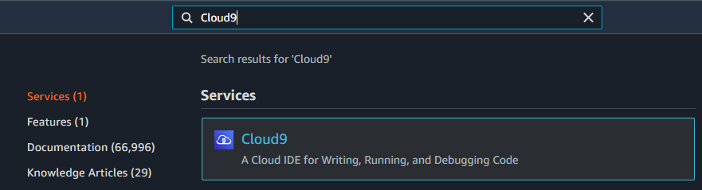
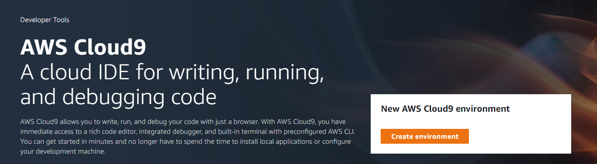
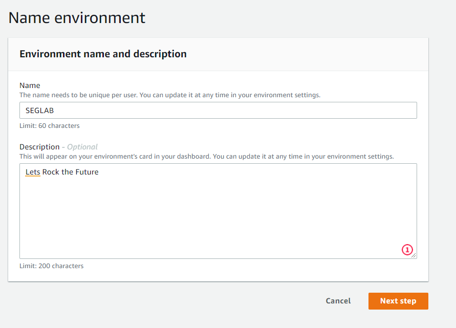
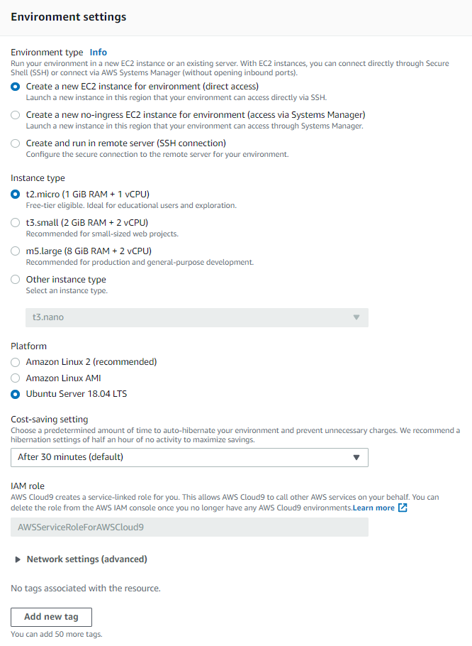

# MBA Cyber Security Forensics, Ethical Hacking & DevSecOps

Nesta configuração você fará a preparação da instância que utilizaremos para os laboratórios envolvendo o ambiente AWS;

## 1. Configurando a instância de trabalho com Cloud9 usando o template

1.1. Para configurar automaticamente faça o login na conta da AWS indicada pelo Professor e acesse o pefil indicado, e em seguida clique no link abaixo para disparar o template de automação:

[](https://console.aws.amazon.com/cloudformation/home?region=us-east-2#/stacks/new?stackName=sandbox-sec&templateURL=https://cf-templates-fiaplabs-automation.s3.amazonaws.com/cloud9-ide-with-ec2-instance-terminate.template.yaml)

Um exemplo mais complexo com configuração de vpc dentro do processo pode ser consultado neste [template de cloudformation](https://aws-quickstart.s3.amazonaws.com/quickstart-cloud9-ide/doc/aws-cloud9-cloud-based-ide.pdf)

1.2. Ao finalizar acesse o console do Cloud9, a URL pode ser encontrada na aba Outputs da tela de automação com Cloud Formation, após acessar execute o script de instalção das ferramentas que serão usadas durante os laboratórios:

```sh
cd ~/environment
git clone https://github.com/FiapDevOps/mba_devsecops
chmod +x ~/environment/mba_devsecops/cloud9/scripts/*.sh

~/environment/mba_devsecops/cloud9//scripts/config.sh
```

---

## 2. Configurando a instância de trabalho com Cloud9 pelo console

2.1. Acesse a conta destinada ao laboratório conforme os dados enviados por e-mail, no painel de serviços da AWS, utilize a barra de busca na área superior para localizar e selecionar o serviço Cloud9:



2.2. No menu seguinte escolha a opção **"Create environment"** para começar a configuração da instância que usaremos como ponto de partida para nossos projetos;



2.3. Para o campo **"Name"** faça o preenchimento com **"SEGLAB**, colocar uma description é opcional;



2.4. Preencha o formulário "Configure settings" de criação da instância utilizando os dados abaixo:

| Campo            | Configuração                                                |
|------------------|-------------------------------------------------------------|
| Environment type | Create a new EC2 instance for environment (direct access)   |
| Instance type    | t2.micro (1 GiB RAM + 1 vCPU)  |
| Platform         | Ubuntu Server 18.04 LTS        |

Qualquer campo não mencionado deve ser mantido com o valor atual do template, ao final do processo configura de acordo com o exemplo abaixo e clique em **Next Step**;



Em seguida clique em **"Create environment"**

Durante o processo de configuração a mensagem **"We are creating your AWS Cloud9 environment. This can take a few minutes."** será exibida

*Aguarde até que o ambiente seja configurado, um termninal de administração será aberto para executar os próximos passos;*

2.5. Após finalizar o processo anterior um terminal será exibido dentro do Cloud9, faça uma cópia do [repositório git do laboratório](https://github.com/fiapsecdevops/mba_devsecops) da disciplina;

```sh
cd ~/environment
git clone https://github.com/FiapDevOps/mba_devsecops
```

2.6. Execute o script de instalação das ferramentas que serão usadas durante os laboratórios:


```sh
chmod +x ~/environment/mba_devsecops/cloud9/scripts/*.sh

~/environment/mba_devsecops/cloud9//scripts/config.sh
```

---

##### Fiap - MBA Cyber Security Forensics, Ethical Hacking & DevSecOps
profhelder.pereira@fiap.com.br

**Free Software, Hell Yeah!**
