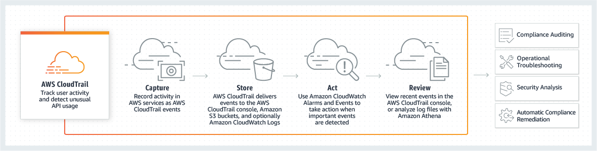

# Objetivo

Explorar o concieto de Object Storage na AWS configurando um bucket para auditoria de acessos na conta do AWS Educate



# Caracteriísticas:

Este laboratório utilizará os recursos da conta AWS Educate para explorar alguns cenários:

- Uso de políticas sobre Buckets e a configuração de objetos com acesso público e privado;
- Uso de um recurso de trail para centralizar logs sobre ações nas contas da AWS;
- Uso do CloudWatch para centralizar os eventos armazenados na conta;
- Proposta do modelo de envio para uma conta de auditoria externa;


# Primeira Parte

Auditando a conta com CloudTrail + CloudWatch

# Item 1: Configurações do Trail:

1.1. Iniciar o ambiente de Desenvolvimento Remoto:

Aceese a console AWS e em seguida selecione o serviço Cloud9, no ambiente **SEGLAB** clique em **OPEN IDE**:


1.1. Acesse o console da AWS, no canto superior esquerdo, no menu Services, escolha Cloud Trail dentro do grupo "Management & Governance", ou localize o serviço digitando "Cloud Trail" na barra de busca;

1.2. Escolha a opção **"Create a trail"**


* Utilize o nome e as opções default de criação que surgirem na tela seguinte e clique no botão **"Create Trail"**

Um novo recurso de Cloud Trail será criado armazenando logs de operações no Bucket indicado no campo **S3 bucket**

# Item 2: Log de eventos ao CloudWatch:

2.1. Abra o console do CloudTrail em [https://console.aws.amazon.com/cloudtrail/](https://console.aws.amazon.com/cloudtrail/)


2.2. Clique sobre o recurso de trail criado e na opção **"CloudWatch Logs"** escolha **Edit**;

2.3. Marque a opção "Enabled" no campo **"CloudWatch Logs"**

2.4. Para a função IAM, escolha a opção **"Exisintg"** e em seguida a Role name trailrole;

2.5. Clique em "Save changes" para finalizar;

---

# Segunda Parte

Aprsentando o conceito de buckets e a gerencia de permissões de acesso:

## Item 1: Testando o uso de object storage

1.1. Acesse o console da AWS, no canto superior esquerdo, no menu Services, escolha S3 dentro do grupo Storage, ou localize o serviço digitando "S3" na barra de busca;

1.2. Escolha a opção **"Create Bucket"**


> Os nomes dos buckets devem ter entre 3 e 63 caracteres e consistir apenas em letras minúsculas, números ou hifens, o nome também deve ser globalmente exclusivo para a AWS, ou seja, não existem dois buckets com o mesmo nome mesmo entre contas distintas, ao digitar o nome do bucket o console da AWS indicará erros ou se o nome já está em uso, como sugestão utilize o nome reportbucket-<SEURM>;

* Utilize a região padrão mantendo o valor default configurado;

* Não é necessário alterar outras opções ou as políticas do bucket por enquanto;

## Item 2: Upload de objetos

Com o bucket criado já é possível executar upload de objetos, um objeto pode ser qualquer tipo de arquivo: um arquivo de texto, uma foto, um vídeo, um arquivo zip e assim por diante.

Em geral serviços de Object Sotrage possuem a opção de incluir metadados com
o objeto e definir permissões para controlar o acesso;

2.1. Clique com o botão direito neste link [new-report.png](https://s3.us-west-2.amazonaws.com/us-west-2-aws-training/awsu-spl/SPL-TF-100-STESS3-2/2.4.4.prod/images/new-report.png), escolha "Salvar link como" ou "Save link as" e salve o arquivo localmente.

2.2. No Console da AWS, encontre e selecione o bucket criado;

2.3. Em seguida escolha a opção **Upload**

> Use este assistente para fazer upload de arquivos selecionando-os com a opção de arras e soltar **"Drag and drop"** ou selecionando a partir do botão **Add files**


2.4. Procure e selecione o arquivo new-report.png que você baixou anteriormente.

2.5. Role para baixo e escolha **"Upload"**

Se o envio do arquivo ocorrer com sucesso uma barra verde indicará o Upload bem-sucedido;

## Item 3: Configurações de acesso público e políticas

3.1. Na página geral do reportbucket, na guia de objetos, localize o arquivo new-report.png, clique sobre o nome do arquivo

3.2. Na seção "Object Overview" ou Visão geral do objeto, localize e copie o link URL do objeto.


O modelo será similar ao formato: https://reportbucket-0935.s3.amazonaws.com/new-report.png

Abra uma nova guia do navegador e cole o link com a URL do objeto no campo de endereço em seguida, pressione Enter.

**Você receberá um erro de acesso negado**

*Mantenha o navegador com o erro de acesso negado aberto e volte a guia com o console na página do S3;*


## Item 4: Configurações de acesso público e políticas

4.1. Ao voltar a página da AWS, localize o botão "Object actions" no canto direito da tela,

4.2. Selecione a opção **"Make Public"** que será o último item na lista de opção de configuração do objeto;


4.3. Você verá uma tela de aviso sobre a configuração do bucket, clique em seguida na opção "Make Public" uma mensagem de erro será exibida:


4.4. Ao tentar tornar o arquivo público será exibido uma mensagem de erro devido a configuração geral do bucket que impede a criação de arquivos públicos;

> Todos os clouds providers utilizam um mecanismo similar de controle que deve estar habilitado salvo em casos onde efetivamente o acesso público é necessário;

4.5. Desta vez utilizaremos uma política configurada diretamente no bucket, para isso acesse a aba opção **"Permissions"** e no campo **"Bucket Policy"** clique em **"Edit"**

Cole o bloco abaixo criando uma politica explicita de acesso de leitura:

```sh
{
    "Version": "2012-10-17",
    "Statement": [
        {
            "Sid": "PublicRead",
            "Effect": "Allow",
            "Principal": "*",
            "Action": [
                "s3:GetObject",
                "s3:GetObjectVersion"
            ],
            "Resource": "arn:aws:s3:::reportbucket-0935/*"
        }
    ]
}
```

Ao final do processo clique na opção **"Save Changes"**

## Item 5: Acessando os logs via Monitoração

5.1. Volte ao menu principal e acesse o recurso CloudWatch

5.2. Escolha a opção **"Log Groups"** dentro do menu **"Logs**, em seguida localize e selecione o grupo criado, ele possuirá o nome **"aws-cloudtrail-logs-*"**

5.3. Ao clicar sobre o grupo você verá uma interface com todos os eventos gerados pelo trail e armazenados para consulta e gatilhos de monitoração no Cloudwatch, utilize a busca a seguir para filtrar os eventos de alteração em permissões dos buckets:

```sh
{ ($.eventSource = s3.amazonaws.com) && (($.eventName = PutBucketAcl) || ($.eventName = PutBucketPolicy) || ($.eventName = DeleteBucketPolicy) || ($.eventName = PutBucketPublicAccessBlock))}
```

---

##### Fiap - MBA Cyber Security Forensics, Ethical Hacking & DevSecOps
profhelder.pereira@fiap.com.br

**Free Software, Hell Yeah!**