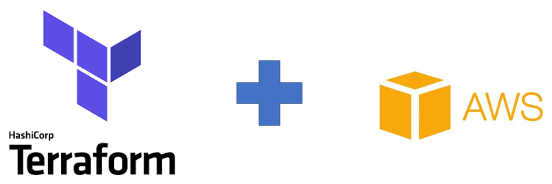

# Objetivo

Utilizar a estrutura declarativa do terraform para orquestrar a criação de um servidor web linux rodando Nginx ou Apache encapsulados em container Docker;



# Caracteriísticas:

Neste laboratório o terraform fica responsável por gerenciar os seguintes itens:

- Criação da instância usando sistema operacional linux;
- Deploy do template responsável por configurar o container Docker;
- Criação do grupo de segurança e regras de Inbound e Outbound;
- Criação do endereço ip elástico e vinculo a instância criada;
- Criação do apontamento de DNS e vinculo ao endereço ip criado;

# Item 1: Configuração de Rede

Para a configuração de rede, utilizaremos o modulo da AWS:
[https://registry.terraform.io/modules/terraform-aws-modules/vpc/aws/latest](https://registry.terraform.io/modules/terraform-aws-modules/vpc/aws/latest);

1.1. Iniciar o ambiente de Desenvolvimento Remoto:

Aceese a console AWS e em seguida selecione o serviço Cloud9, no ambiente **SEGLAB** clique em **OPEN IDE**:


1.2. Utilizando a ferramenta AWS CLI verifique a configuração de rede, subnet e security groups atuais:

```sh
aws ec2 describe-vpcs
aws ec2 describe-subnets
aws ec2 describe-security-groups --output text
```

1.3. Acesse o diretório SEGLAB01/terraform/network e inicialize o serviço:

```sh
cd $PWD/SEGLAB01/terraform/network
terraform init
```

1.4. Em seguida utilize a instrução plan para verificar a sequência de tarefas que serão executadas pelo terraform:

```sh
terraform plan
```

> Verifique que neste diretório encontram-se as instruções de automação para criação da Virtual Private Network que será usada para hospedar a instância Linux, bem como a configuração dos Grupos de Segurança que serão vinculados a nova instância;

1.5. Após verificar os detalhes do status de execução utilize o terraform para criar os objetos de acordo com o estado esperado:

```sh
terraform apply
```

1.6. As ações que serão executadas durante o processo de automação serão listadas, verifique os items do checklist para entender melhor o que será construido via terraform e em seguida digite "yes" e tecle "Enter" para confirmar a execuçção:

```sh
Do you want to perform these actions?
  Terraform will perform the actions described above.
  Only 'yes' will be accepted to approve.

  Enter a value: yes
```

1.7. Após configurar verifique novamente os recursos de rede disponíveis:

```sh
```sh
aws ec2 describe-vpcs
aws ec2 describe-subnets
aws ec2 describe-security-groups --output text
```

---
##### Fiap - MBA Cyber Security Forensics, Ethical Hacking & DevSecOps
profhelder.pereira@fiap.com.br

**Free Software, Hell Yeah!**